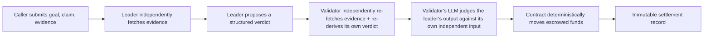

# AgentIntentSettlement

AgentIntentSettlement is a reusable GenLayer Intelligent Contract that adjudicates whether an autonomous agent's claimed action actually fulfilled a stated natural-language intent, using submitted evidence and multi-validator consensus, and enforces the financial consequence — escrow release, partial payout, slashing, or refund — automatically based on the result.

## Deployed contract

**Network:** GenLayer Studio Network (chain id 61999)

**Contract:** [`0xa4499ccecfc5474c76B6a0A9E17a2103aec8aE41`](https://genlayer-explorer.vercel.app/address/0xa4499ccecfc5474c76B6a0A9E17a2103aec8aE41)

[`contracts/AgentIntentSettlement.py`](contracts/AgentIntentSettlement.py) is the implementation source of truth. This deployment reflects that file exactly, and is live-verified end to end — deploy, three independent `settle_intent` settlements, and reputation aggregation all reached clean `ACCEPTED`/`MAJORITY_AGREE` consensus (see [`docs/security-model.md`](docs/security-model.md#studio-network-verification)). The same code was previously deployed and partially verified on GenLayer Bradbury testnet; Studio Network is used here because Bradbury was experiencing a testnet-wide transaction-activation backlog at verification time (also documented in `docs/security-model.md`) — the contract itself is network-agnostic and the design is unchanged.

## The trust problem

The agentic economy needs a way to settle claims like "the agent completed the task" without a human reviewing every case. A deterministic contract can check a timestamp or a signature, but it cannot judge whether a delivered piece of work, a completed transaction, or a claimed action actually matches what was asked for in plain language. That judgment call — grounded in evidence, resistant to a self-interested party's own framing of the facts — is exactly what GenLayer's consensus over non-deterministic LLM execution is for.

## What it does

A caller submits a natural-language goal, the agent's claim, and evidence (plain text, fetched URLs, IPFS content, or screenshots). The contract adjudicates fulfillment under multi-validator consensus and returns a strict, structured verdict: whether the goal was fulfilled, a confidence score, an evidence-quality rating, and a recommended action. If the call was funded (payable), that recommended action is executed immediately and deterministically — the escrowed value is released, partially paid out, sent to a treasury as a penalty, or refunded, with no separate step required.

AgentIntentSettlement is a settlement primitive. It does not perform the underlying work, host evidence, or provide identity, marketplace, or dispute-arbitration functionality beyond what is described below.

## How it works



1. The caller calls `settle_intent` with a goal, a claim, evidence, and optionally GEN value to escrow.
2. The leader independently fetches any URL/IPFS/screenshot evidence and produces a structured verdict.
3. Every validator independently repeats the SAME fetch (its own fresh request, never a reuse of the leader's) and forms its own understanding of the evidence, then its own LLM call judges whether the leader's output is a faithful, well-justified execution of the adjudication task given that independently-gathered evidence — via `gl.eq_principle.prompt_non_comparative`, GenLayer's own SDK primitive for this pattern, not a hand-rolled comparison. A validator that only checked the leader's JSON shape without re-acquiring evidence could let two conflicting fulfillment decisions both pass; this is the mechanism that closes that gap.
4. Once agreed, deterministic contract code applies the consistency rules below and executes the verdict's financial consequence.

## Why GenLayer is required

Ordinary deterministic code can validate schemas, enforce length limits, track escrow balances, and move funds. It cannot decide whether a block of free-text evidence actually demonstrates that a natural-language goal was accomplished — that is an open-ended semantic judgment. GenLayer's non-deterministic execution with Equivalence Principle consensus is what lets that judgment happen on-chain, with independent validators checking the leader's output rather than trusting it outright.

## Verdict consistency guarantees

The LLM's raw output is never trusted directly. Regardless of what the leader/validator LLM calls produce, the contract's own deterministic code enforces these rules on the agreed output before it can move funds or reputation:

- `release_escrow` requires **all** of: `fulfilled = true`, `evidence_quality = "strong"`, at least one *externally verifiable* evidence item (a fetched URL, IPFS reference, or screenshot — not submitter-authored text alone), and a minimum self-reported confidence. A verdict missing any of these is downgraded to `escalate`, never silently trusted.
- `partial_payout` is capped well below full credit whenever evidence quality is only `"weak"` — a verdict cannot claim near-total credit on unconvincing evidence and drain an escrow through the "partial" path.
- `fulfilled = true` can never pair with `slash`, `reject`, or `partial_payout` — those actions require `fulfilled = false`.
- `reasoning` must meet a minimum substantiveness floor; a one-word justification is not accepted as a valid verdict.

These rules exist specifically because an LLM's raw output cannot be assumed self-consistent, and because the contract's own return values must be well-typed (GenLayer's calldata encoding has no floating-point type, so `confidence` and `partial_credit` are represented as decimal strings throughout).

## Contract interface

AgentIntentSettlement exposes 8 public methods: 3 writes and 5 views.

| Type | Methods |
|---|---|
| Writes | `settle_intent`, `resolve_escrow`, `resolve_stale_escrow` |
| Settlement views | `get_settlement`, `has_settlement` |
| Escrow views | `get_escrow` |
| Reputation views | `get_reputation`, `has_reputation` |

```python
@gl.public.write.payable
def settle_intent(self, settlement_id: str, natural_language_goal: str, agent_claim: str,
                   evidence_json: str, optional_criteria: str = "", context_json: str = "{}") -> dict
    # Adjudicates fulfillment and executes the resulting escrow action. Idempotent per
    # settlement_id, scoped to the original caller — a different sender reusing an
    # already-claimed id is rejected, not silently given someone else's verdict.

@gl.public.write
def resolve_escrow(self, settlement_id: str, action: str, beneficiary_address: str = "") -> dict
    # Lets the original funder manually settle a case the automated pipeline escalated.

@gl.public.write
def resolve_stale_escrow(self, settlement_id: str) -> dict
    # Permissionless refund-only fallback: after 30 days of an unresolved escalation,
    # anyone may trigger a refund back to the original funder.

@gl.public.view
def get_settlement(self, settlement_id: str) -> dict
@gl.public.view
def has_settlement(self, settlement_id: str) -> bool
@gl.public.view
def get_escrow(self, settlement_id: str) -> dict
@gl.public.view
def get_reputation(self, agent_id: str) -> dict
@gl.public.view
def has_reputation(self, agent_id: str) -> bool
```

## Verdict schema

`settle_intent` and `get_settlement` return a `verdict` object with exactly this shape:

```json
{
  "fulfilled": true,
  "confidence": "0.9500",
  "reasoning": "2-4 sentences grounded in specific evidence items",
  "partial_credit": "1.0000",
  "evidence_quality": "strong | weak | conflicting | insufficient",
  "violations": ["list of concrete problems found, empty if none"],
  "recommended_action": "release_escrow | partial_payout | slash | reject | escalate"
}
```

`confidence` and `partial_credit` are decimal strings, not JSON numbers — GenLayer's calldata encoding has no float type, and every consumer should `float()`-parse them rather than expect a numeric type directly.

## Escrow model

`settle_intent` is payable. Any GEN sent with the call is held by the contract and moved according to the verdict:

| `recommended_action` | Effect |
|---|---|
| `release_escrow` | Full amount to `context.beneficiary_address`, or refunded to the caller if none was given. |
| `partial_payout` | Split between beneficiary and caller by `partial_credit` (capped on weak evidence). |
| `slash` | Full amount to `context.treasury_address`, or held if none was given. |
| `reject` | Full refund to the caller. |
| `escalate` | Held until the funder calls `resolve_escrow`, or anyone calls `resolve_stale_escrow` after 30 days. |

## Reputation

If a caller tags a settlement with `context.agent_id`, each settlement updates a running, on-chain reputation record for that identifier — release/partial/slash counts and a running score in `[-1.0, 1.0]`, queryable via `get_reputation`. This is entirely optional and additive.

## Integration example

```python
# From another Intelligent Contract, called from the deterministic part of
# a write method (cross-contract calls are forbidden inside run_nondet blocks):
import genlayer.gl as gl

SETTLEMENT_CONTRACT = Address("0xa4499ccecfc5474c76B6a0A9E17a2103aec8aE41")

verdict = gl.get_contract_at(SETTLEMENT_CONTRACT).emit(
    value=u256(escrow_amount)
).settle_intent(
    settlement_id=self.next_id(),
    natural_language_goal="Agent delivered the requested API integration",
    agent_claim="Integration complete, see evidence",
    evidence_json=evidence_json,
    context_json='{"beneficiary_address": "0x...", "agent_id": "agent-42"}',
)
```

## Security audits and reviews

This contract went through three independent review passes before this deployment, all documented in [`docs/security-model.md`](docs/security-model.md):

1. **First adversarial audit** found and closed a calldata-encoding defect that would have crashed every public method call in production the moment a verdict contained a numeric field, a settlement-id front-running path that could strand a legitimate funder's escrowed value, and missing input-size limits.
2. **Second adversarial audit** found and closed a partial-payout logic gap that allowed near-total escrow extraction on weak, self-authored evidence while completely bypassing the stronger evidence requirements gating full release — the most severe finding across all three passes — along with tightening the evidence-quality and confidence requirements for full release.
3. **Portal steward review** flagged that the validator only checked the leader's output shape and never independently verified the evidence or the fulfillment decision — meaning two conflicting substantive verdicts could both pass. Fixed by redesigning the adjudication pipeline around `gl.eq_principle.prompt_non_comparative`, so every validator genuinely re-fetches evidence and re-derives its own judgment (see [How it works](#how-it-works) above).

All three fixes were verified with real `settle_intent` transactions on live Bradbury, not only against the local test suite. A follow-up liveness-tuning pass then reduced per-validator independent workload (tighter evidence/prompt size ceilings, a per-call fetch cap) and re-verified live — see [`docs/security-model.md`](docs/security-model.md) for both the original steward-review verification and the liveness-tuning results, including a disclosed, not-fully-eliminated `DETERMINISTIC_VIOLATION`/timeout variability under current Bradbury network conditions.

## Testing

85 direct-mode tests across five files in [`tests/direct/`](tests/direct/), covering the happy path, insufficient/partial/conflicting evidence, prompt-injection resistance, escrow across all five recommended actions, front-running and idempotency, input-size limits, calldata-safety (no float leaks into any return value), the per-call evidence-fetch cap, and every consistency rule above with a concrete failing-verdict payload for each. Run with:

```bash
gltest tests/direct/ -v
```

`genvm-lint check contracts/AgentIntentSettlement.py` passes clean.

## License

MIT — see [LICENSE](LICENSE).
